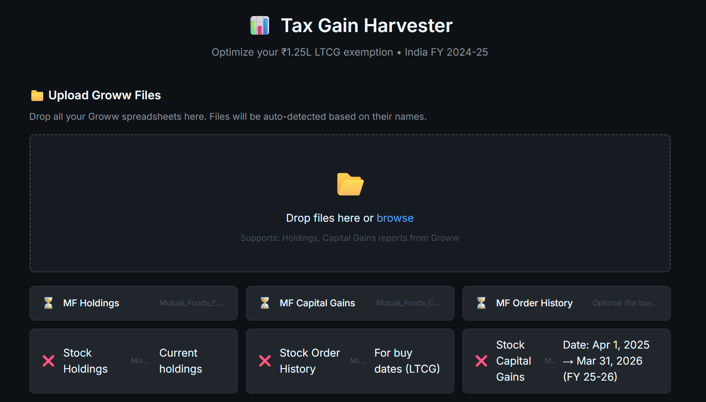

# 📊 Tax Gain Harvester

> **Maximize your ₹1.25L LTCG exemption** - Optimize tax-free capital gains harvesting from **Groww** portfolios.

> ⚠️ **Groww-only**: Currently supports Groww's Excel format only (not Zerodha, Upstox, etc.)

---

## 🎯 What is This?

Indian investors get a **₹1.25 lakh tax exemption** on Long Term Capital Gains every year. This tool helps you:

✅ Calculate your remaining LTCG exemption (after realized gains/losses)  
✅ Identify which holdings you can harvest (>12 months old only)  
✅ Get optimal sell-and-rebuy recommendations  
✅ Exclude ELSS (3-year lock) and short-term holdings automatically

**Tax Savings:** Harvest up to ₹1.25L tax-free = save up to **₹15,625** per year (12.5% tax)

---

## � Quick Start

### 1. Download Files from Groww

| Required Files | Groww Location | Date Range |
|----------------|----------------|------------|
| MF Holdings | Portfolio → MF → Download Statement | Current |
| MF Capital Gains | Portfolio → MF → Capital Gains Report | **Apr 1, 2025 → Mar 31, 2026** |
| Stock Holdings | Portfolio → Stocks → Holdings | Current |
| Stock Capital Gains | Portfolio → Stocks → Capital Gains | **Apr 1, 2025 → Mar 31, 2026** |
| **Stock Order History** | Portfolio → Stocks → Order History | **Apr 1, 2020 → Today** |

> ⚠️ **Stock Order History is required** to verify 12-month holding periods. Without it, LTCG calculations will be inaccurate.

### 2. Use the App

**🌐 Live App:** [https://hardik500.github.io/groww-tax-gain-harvester/](https://hardik500.github.io/groww-tax-gain-harvester/)

1. Open the link above
2. Drag & drop your Excel files
3. Click "Calculate"
4. See recommendations for which assets to harvest

---

## 📊 Features

- **Auto-detects** Groww file types by filename
- **FIFO logic** to track exact buy dates per holding unit
- **Excludes** ELSS funds and short-term holdings
- **Multiple scenarios**: Best efficiency, MF-only, Stocks-only
- **Full breakdown**: LTCG, STCG, LTCL, STCL with MF/Stock splits

---

## 🧮 Tax Rules (India FY 2025-26)

- **LTCG Exemption:** ₹1,25,000/year
- **Tax Rate:** 12.5% above exemption
- **Holding Period:** >12 months for equity/MF
- **Loss Offset:** STCL → STCG first, then LTCG; LTCL → LTCG only

---

## ⚠️ Disclaimer

For **informational purposes only**. Always consult a tax advisor before making investment decisions.

---

## 📄 License

MIT

---

**Star ⭐ this repo if it saved you taxes!**
