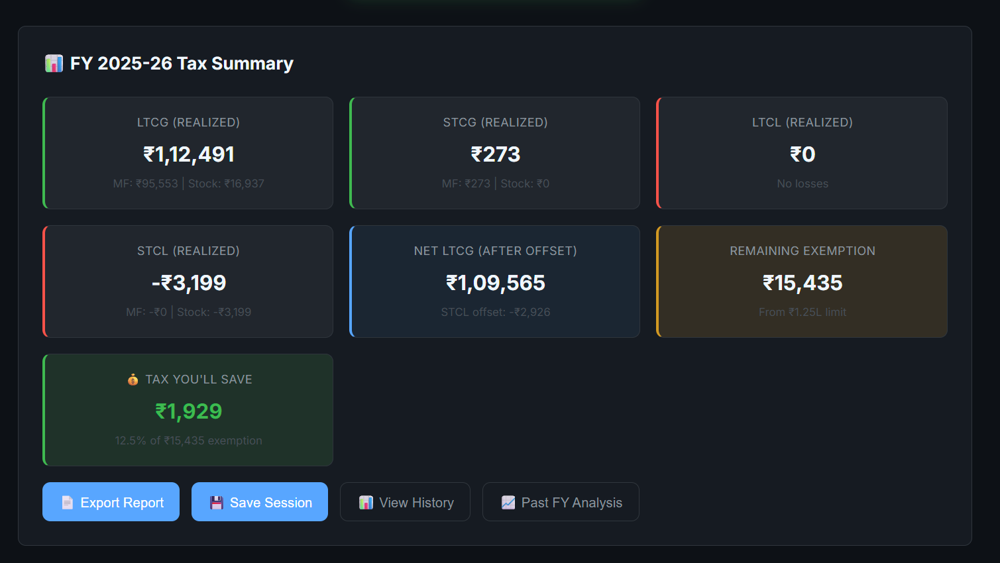

# 📊 Tax Gain Harvester

> **Maximize your ₹1.25L LTCG exemption** - A smart web app for Indian investors to optimize tax-free capital gains harvesting from **Groww** portfolios.

> ⚠️ **Note**: This app currently **only supports Groww's Excel format**. It does not work with Zerodha, Upstox, or other brokers.

---

## 🎯 The Problem

As an Indian equity/mutual fund investor, you get a **₹1.25 lakh tax exemption** on Long Term Capital Gains (LTCG) every financial year. However:

- ❌ **Groww doesn't tell you how to harvest it** - You see your realized gains, but no guidance on what to sell next
- ❌ **Manual calculation is error-prone** - Tracking which assets qualify for LTCG (>12 months), offsetting losses, and optimizing capital allocation is complex
- ❌ **You might miss the exemption** - If you don't harvest before March 31, the exemption is lost forever
- ❌ **Risk of tax errors** - Accidentally selling short-term holdings thinking they're long-term can trigger unexpected STCG tax

---

## 💡 The Solution

**Tax Gain Harvester** analyzes your Groww data files and:

✅ Calculates your **exact remaining LTCG exemption** (after accounting for realized gains/losses this FY)  
✅ Identifies **which specific holdings** you can harvest (only assets held >12 months)  
✅ Recommends **optimal sell-and-rebuy strategy** to maximize tax savings  
✅ Shows **MF vs Stock breakdown** for all gains/losses (LTCG, STCG, LTCL, STCL)  
✅ Excludes **ELSS funds** (3-year lock-in) and **short-term holdings** automatically  
✅ Provides **multiple optimization scenarios** - best efficiency, MF-only, stocks-only, lowest capital

---

## 🚀 Features

### 📁 Auto-Detects Groww Files
Drop your Excel files - the app automatically recognizes:
- Mutual Fund Holdings
- MF Capital Gains Report (FY 2025-26)
- MF Order History *(optional, for buy dates)*
- Stock Holdings Statement
- Stock Capital Gains Report (FY 2025-26)
- **Stock Order History** *(required for accurate LTCG calculation)*

### 📊 Comprehensive Tax Dashboard

- **Realized Gains/Losses**: LTCG, STCG, LTCL, STCL with MF/Stock breakdown
- **Net LTCG**: After applying loss offset rules
- **Remaining Exemption**: How much you can still harvest tax-free
- **Tax Savings**: 12.5% of harvestable amount

### 🎯 Smart Recommendations
- **Efficiency-Optimized**: Harvest maximum gains with minimum capital
- **Asset-Specific**: Filter by MF-only or Stocks-only
- **Partial Harvesting**: Sell only LTCG-eligible units (e.g., 50 out of 100 shares)
- **Actionable Steps**: Exact units to sell and rebuy

### 🔍 Full Transaction History
- View all redeemed MFs and stocks this FY with buy/sell dates
- Track current holdings with unrealized gains

---

## 🛠️ Tech Stack

- **Frontend**: Vanilla HTML, CSS, JavaScript *(no frameworks - runs anywhere)*
- **Excel Parsing**: [SheetJS](https://sheetjs.com/) (xlsx.js)
- **Styling**: Modern CSS with dark mode, glassmorphism effects
- **Date Handling**: Robust parser for DD-MM-YYYY, Excel serial numbers

---

## 📖 How to Use

### 1. Download Files from Groww

| File Type | Path on Groww | Date Range |
|-----------|---------------|------------|
| **MF Holdings** | Portfolio → Mutual Funds → Download Statement | Any recent date |
| **MF Capital Gains** | Portfolio → Mutual Funds → Capital Gains Report | **Apr 1, 2025 → Mar 31, 2026** |
| MF Order History | Portfolio → Mutual Funds → Order History | Apr 1, 2020 → Today *(optional)* |
| **Stock Holdings** | Portfolio → Stocks → Holdings Statement | Any recent date |
| **Stock Capital Gains** | Portfolio → Stocks → Capital Gains Report | **Apr 1, 2025 → Mar 31, 2026** |
| **Stock Order History** | Portfolio → Stocks → Order History | **Apr 1, 2020 → Today** *(required)* |

> ⚠️ **Important**: Stock Order History is **required** for accurate LTCG calculations. Without it, the app cannot verify 12-month holding periods.

### 2. Open the App

**🌐 Use the deployed version:** [https://hardik500.github.io/groww-tax-gain-harvester/](https://hardik500.github.io/groww-tax-gain-harvester/)

No installation needed - just open the link in your browser!

*(Alternatively, you can clone the repo and run locally if you prefer)*

### 3. Upload Files

Drag and drop all downloaded Excel files into the app. It will auto-detect file types and show ✅ when loaded.

### 4. Calculate

Click **"⚡ Calculate Optimal Harvesting"** to see:
- Your current tax position
- Recommended actions (which funds/stocks to sell)
- Potential tax savings

---

## 🧮 Tax Rules (India FY 2025-26)

| Parameter | Value |
|-----------|-------|
| **LTCG Exemption** | ₹1,25,000 per FY |
| **LTCG Tax Rate** | 12.5% (on gains above exemption) |
| **Holding Period** | >12 months for equity/MF |
| **Wash Sale Rules** | None (you can rebuy immediately) |
| **Loss Offset** | STCL offsets STCG first, then LTCG; LTCL offsets LTCG only |

---

## 🎓 Example Scenario

**Your Situation:**
- Already realized ₹50,000 LTCG from MF redemptions (July 2025)
- Hold ₹2L unrealized gains across stocks and MFs
- Some stocks bought in 2020 (LTCG eligible), some in 2025 (STCG - not eligible)

**What the App Does:**
1. ✅ Calculates remaining exemption: ₹1,25,000 - ₹50,000 = **₹75,000**
2. ✅ Filters out stocks bought in 2025 (short-term)
3. ✅ Recommends harvesting ₹75,000 from your oldest holdings
4. ✅ Shows you'll save **₹9,375** in taxes (12.5% of ₹75k)

---

## 🐛 Known Limitations

- **Groww-only**: Currently supports only Groww's Excel format (not Zerodha, Upstox, etc.)
- **India-only**: Tax rules are specific to Indian FY 2025-26
- **No sell history**: Uses simplified FIFO assumption (held units = most recent buys)
- **Disclaimer**: This tool provides estimates. Always consult a tax advisor for filing.

---

## 🤝 Contributing

Found a bug or have a feature request? Please open an issue!

Contributions welcome:
- Support for other brokers (Zerodha, Upstox)
- Better FIFO logic using actual sell history
- Tax loss harvesting (for carry-forward)
- Multi-year analysis

---

## 📄 License

MIT License - feel free to use and modify!

---

## ⚠️ Disclaimer

This app is for **informational purposes only**. Tax laws are complex and subject to change. Always verify calculations with **a qualified tax advisor** before making investment decisions. I am not liable for any losses or tax liabilities arising from use of this tool.

---

**Star ⭐ this repo if it saved you taxes!**
